# Out Of Office Web Application

## 
This project contains sample web application for employee management. More details described in [task description](TaskDescription.pdf)(download file)

## How To Launch
1. Make sure you have installe .NET SDK and Entity Framework Core tools globally (`dotnet tool install --global dotnet-ef`).
2. In project folder open OutOfOfficeApp folder and run `dotnet ef database update`. This command will create database and populate it with initial data.
3. Execute application:
   1. Open and execute project with Visual Studio.
   2. Or you can build and run project with `dotnet run` (before this set ASPNETCORE_ENVIRONMENT variable to "Development"  `setx ASPNETCORE_ENVIRONMENT "Development"`).

if you want to create database by your own
there is SQL script to create and populate tables named `MigrationsScript.txt` (script was generated by `Script-Migration` command from EF tools).
In that case you should provide connection string to db in `appsettings.json` file
```
"ConnectionStrings": {
  "AppDb": "YourConnectionString"
}
```

## Database Diagram
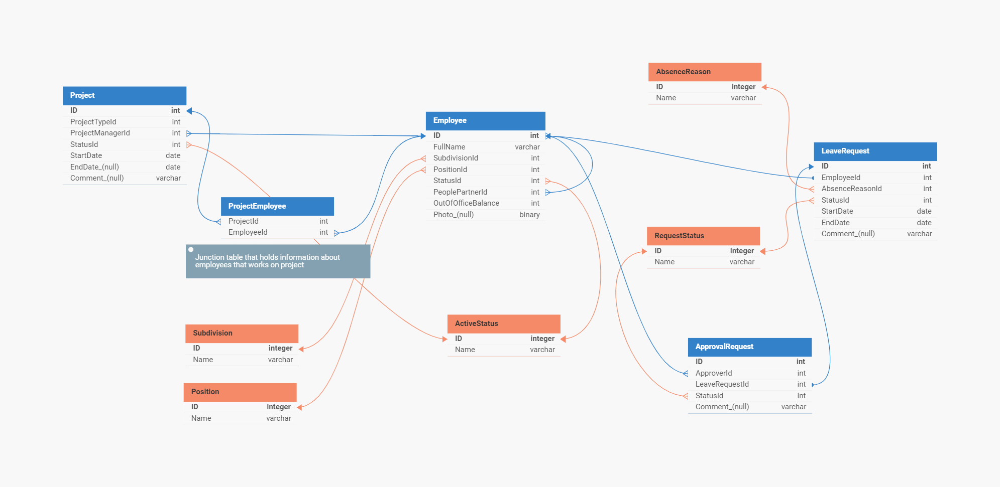

## Predefined users

| ID | Role          | Name       |
|----|---------------|------------|
| 1  | HR            | HR 0       |
| 2  | HR            | HR 1       |
| 3  | PM            | PM 0       |
| 4  | PM            | PM 1       |
| 5  | Employee      | Employee 0 |
| 6  | Employee      | Employee 1 |
| 7  | Employee      | Employee 2 |
| 8  | Administrator | Admin 0    |

## Screenshots

### Welcoming page
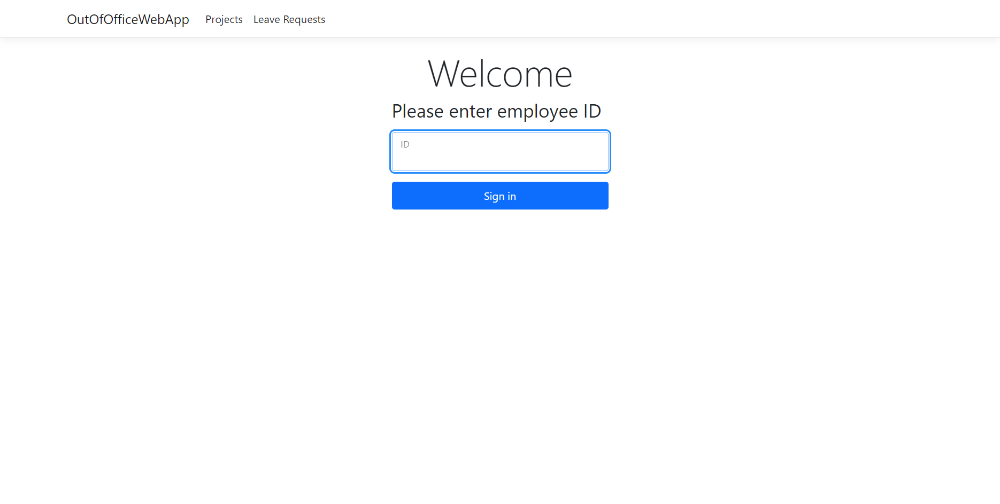

### Welcoming page with logged in user
.png)

### Employee's leave request
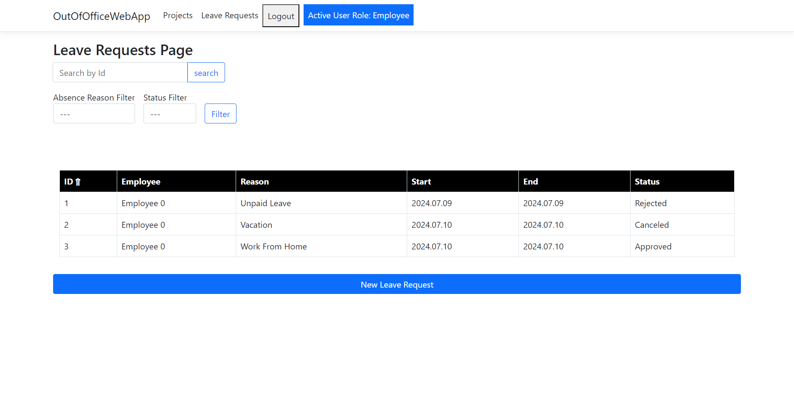

### New leave request form
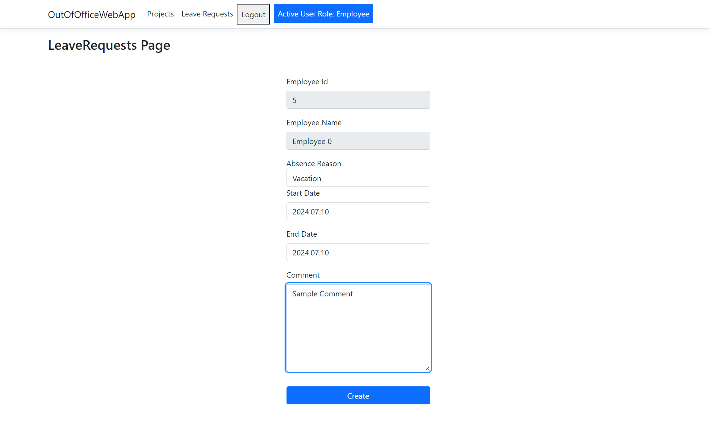

### Created leave request details
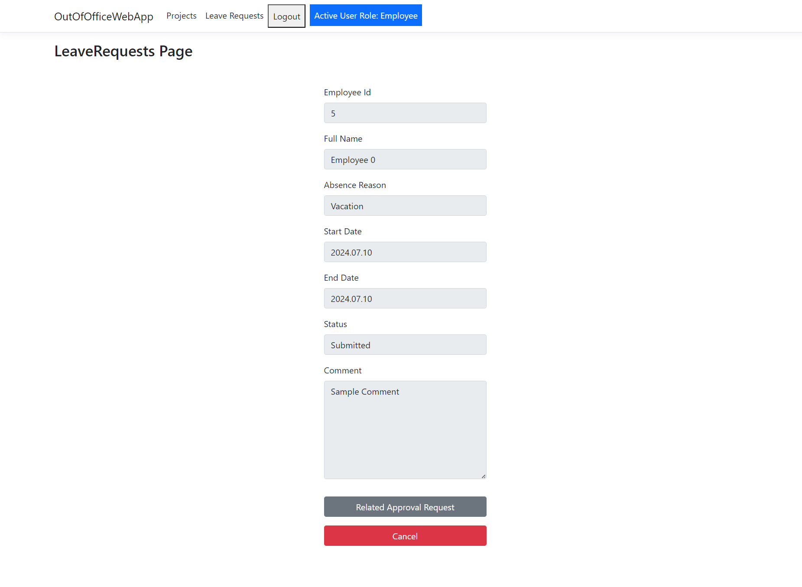

### Approve requests list
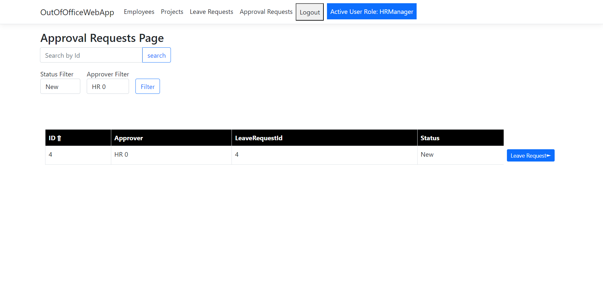

### Approve request details
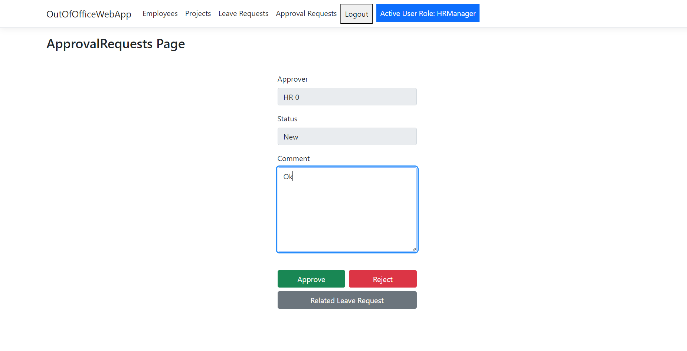

### Employees list
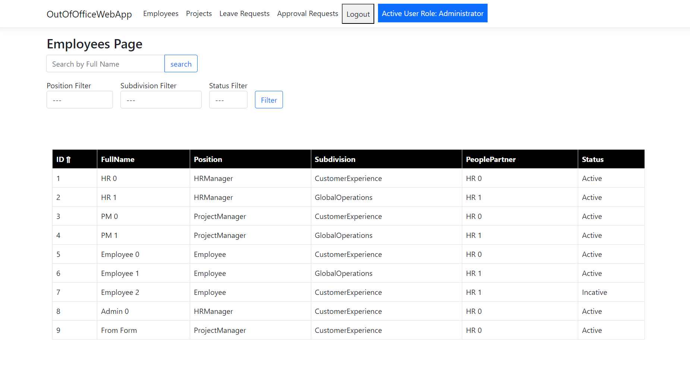

### Employees edit form
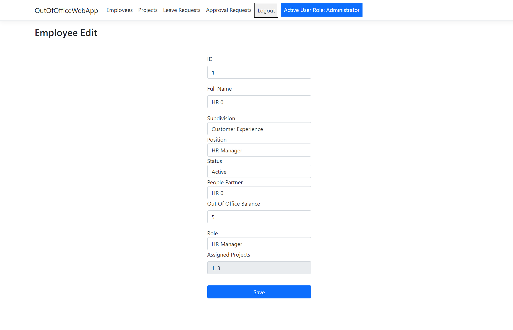

### Employees edit form viewed as project manager
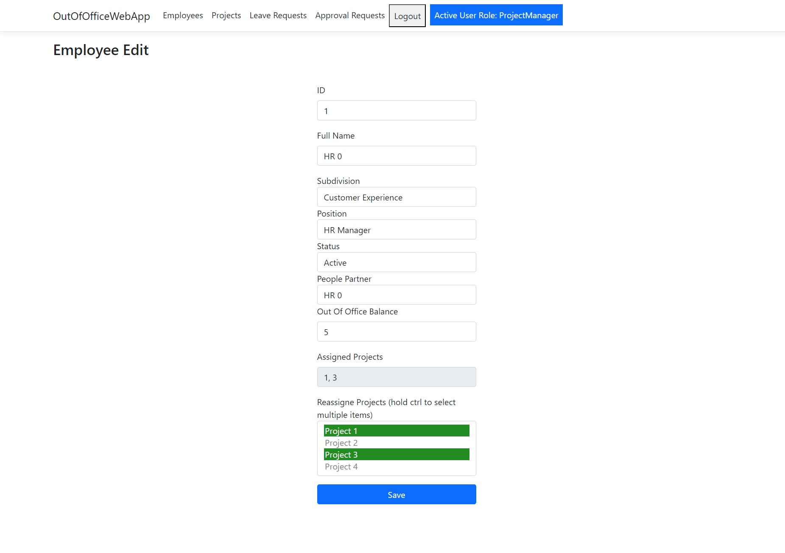

### Projects list
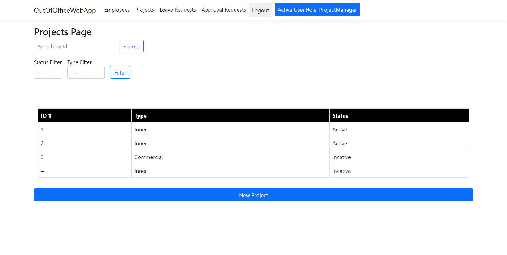

### Projects edit form
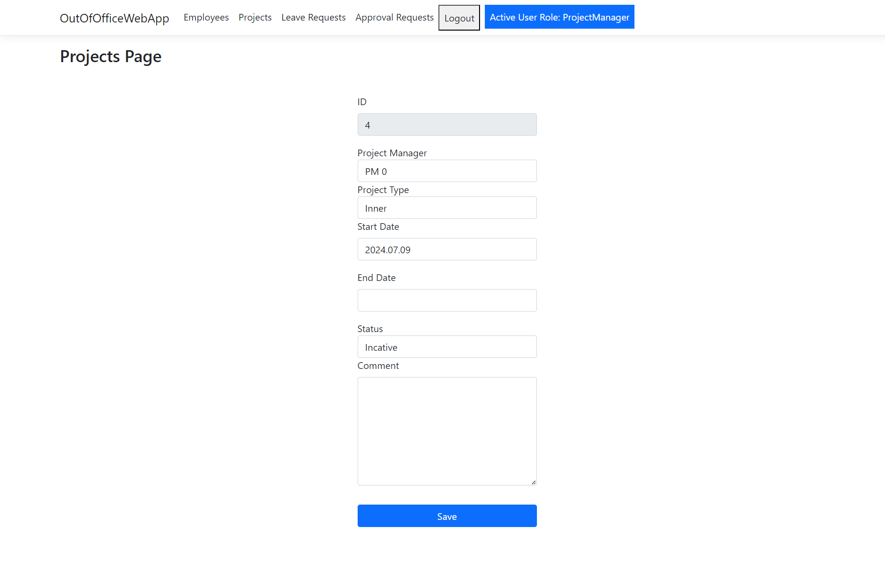

